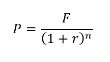

# Present Value Calculator

Suppose you want to deposit a certain amount of money into a savings account and then leave 
it alone to draw interest for the next 10 years. At the end of 10 years you would like to 
have $10,000 dollars in the account. How much do you need to deposit today to make that happen?
You can use the present-value formula to find out.

The terms of the formula are as follows:  
- P is the present value, the amount you need to deposit today. 
- F is the future value that you want to have in the account  
- r is the annual interst rate  
- n is the number of years that you plan to let the money sit in the account  

Write a method named **PresentValue** that performs this calculation. The method should accept 
the future value, annual interest rate, and the number of years as arguments. It should return 
the present value, which is the amount you need to deposit today. 

You should also have a method to validate user input and another method to display the output
to the user.

*Use good programming variable names.* Just because the mathematical formula uses single letters
does NOT mean you should use single-character variable names in your code.

The form layout has been provided to you.

## Grading Criteria

	Program properly calculates and displays the present value    
	Program uses requested methods  
	Click method properly calls the other methods  

	PresentValue Method  
		Passes arguments to method  
		Calculates value properly  
		Returns value  

	Validation Method  		
		Checks for all appropriate errors  
		Uses proper structure  
		Uses specific error messages  
		Returns a Boolean  

	Display Method  
		Displays results properly  
		Uses format codes and complete sentences  
					
	Variables declared in appropriate places with appropriate scope and type  	
	Variables named properly  
	Comments/Documentation/Format/Readability/Organization  		

## Test Data

F = $10,000  
r = 3%  
n = 10 years  
P = $7440.94  
