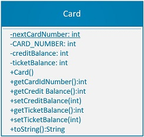
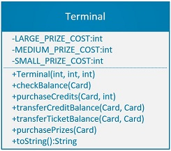
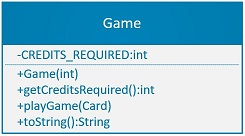

# Arcade Simulation

### Overview
You are going to create an arcade simulation. The arcade consists of several interacting objects.    
Cards store information about their current credit balance, ticket balance, and card number. 
A terminal can be used to convert money into game credits. The terminal is also used to check 
a card’s credit balance and ticket count, and to transfer credits or tickets between cards.
Credits are loaded onto plastic game cards. This data is stored in a card’s magnetic strip. 
Cards may be swiped at any arcade game through the game’s magnetic card reader. Games subtract credits from a card, but award tickets. 
Tickets are also stored on a card’s magnetic strip. Tickets may be exchanged for prizes at the terminal. 
_Well-made toString() methods will come in very handy if you reuse them in your code_


### Tasks
Write a Java program that models the properties, behaviors, and interactions of objects at the arcade. You are provided with a main class
that will test your cother classes. DO NOT MODIFY THE MAIN/DRIVER CLASS.


### Cards
The magnetic strip on game cards offers limited storage space and zero computing power. Cards store information about their current credit balance, 
ticket balance, and card number. Neither balance should ever be negative, but hat is enforced by the terminal anc games. Individual cards are 
incapable of performing calculations, including simple addition, or realizing that their balances could go negative. Every card is created with a 
unique integer identification number. Although each individual card is incapable of simple addition, it’s still possible to perform calculations with 
properties that belong to all cards.


### Games
Games require a certain number of credits to be played. Each game is equipped with a magnetic card reader and LCD display. Swiping a 
card reduces its credit balance, but awards a random, non-negative number of tickets, up to 5. Print the card number, number of tickets won, 
along with the new total. Print a message if a card has insufficient credits to play a game. The “Win Random Tickets Game!” is actually 
a terrible game. Quite boring, but adequate for the simulation.


### Terminals
Each terminal contains a magnetic card reader. A terminal accepts money which is converted to credits on a card. Money is accepted as whole 
numbers. Credits are awarded at a rate of 2 credits for every $1. Players may use a Terminal to check their card’s balances. Include the card’s 
number in this printout. All credits or tickets may be transferred from one card to another. Always print a card’s balances when 
either credits or tickets are accessed through a terminal. Finally, tickets may be exchanged at terminals for prizes. A terminal offers 3 different prizes,
small, medium and large. The terminal should give out the maximum number of large prizes, then medium prizes, followed by small prizes until
the card does not have enough remaining tickets to buy additional prizes. 

### UML Class Diagrams
    

  
### Main Method - Arcade/Main/Driver/Client Class
#### DO NOT EDIT THIS CLASS
_If anything does not work, the problem is in the classes you have created and should be fixed there._  

This class will instantiate a terminal, two cards and a game. It will then:
- Load credits onto each card.
- Play games using both cards.
- Transfer the balance of credits and tickets from Card 1 to Card 2.
- Request prizes using Card 2.
- Try to play a game and request a prize using Card 1.

### Sample Run
```
Terminal Created  
Card #1 created.  
Card #2 created.  
Game Created. 2 credits required to play.  
  
Purchased 10 credits for 5 dollars on card #1  
Card #1 has 10 credits and 0 tickets remaining.  
  
Purchased 6 credits for 3 dollars on card #2  
Card #2 has 6 credits and 0 tickets remaining.  

This game requires 2 credits to play. Processing...  
Deducting 2 credits from card #1.   
Playing the game.  
You have won 5 tickets!  
Card #1 has 8 credits and 5 tickets remaining.  
  
This game requires 2 credits to play. Processing...  
Deducting 2 credits from card #1.   
Playing the game.  
You have won 1 tickets!  
Card #1 has 6 credits and 6 tickets remaining.  
  
This game requires 2 credits to play. Processing...  
Deducting 2 credits from card #2.   
Playing the game.  
You have won 4 tickets!  
Card #2 has 4 credits and 4 tickets remaining.  
  
This game requires 2 credits to play. Processing...  
Deducting 2 credits from card #2.   
Playing the game.  
You have won 5 tickets!  
Card #2 has 2 credits and 9 tickets remaining.  
  
This game requires 2 credits to play. Processing...  
Deducting 2 credits from card #2.   
Playing the game.  
You have won 4 tickets!  
Card #2 has 0 credits and 13 tickets remaining.  
  
This game requires 2 credits to play. Processing...  
Sorry. You do not have enough credits to play this game.  
Card #2 has 0 credits and 13 tickets remaining.  
  
Checking Balances...  
Card #1 has 6 credits and 6 tickets remaining.  
Card #2 has 0 credits and 13 tickets remaining.  
  
Credit balance of 6 transfered from card #1 to card #2.  
Card #1 has 0 credits and 6 tickets remaining.  
Card #2 has 6 credits and 13 tickets remaining.  
  
Ticket balance of 6 transfered from card #1 to card #2.  
Card #1 has 0 credits and 0 tickets remaining.  
Card #2 has 6 credits and 19 tickets remaining.  
  
You have purchased:  
0 large prize(s)  
1 medium prize(s)  
0 small prize(s)  
Card #2 has 6 credits and 4 tickets remaining.  
  
This game requires 2 credits to play. Processing...  
Sorry. You do not have enough credits to play this game.  
Card #1 has 0 credits and 0 tickets remaining.
```


## Evaluation
- Project runs without error with no modifications to the Arcade class
- Formatting, comments, etc..
- Classes as below

#### Card Class
- Fields
- Constructor
- Accessors/ Mutators (no calculations allowed)
- toString()

#### Game Class
- Fields 
- Constructor
- Accessors/Mutators
- Other methods
- toString()

#### Terminal Class
- Fields
- Constructors
- Accessors/Mutators
- Other methods
- toString()


