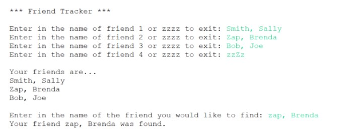

# J1-Ch7-Lab1

## Instructions
Create a program that does the following:
- Prompts the user to enter in the names of up to 12 of their friends and stores the data entered in an array
- The user should be able to exit the input loop before entering 12 friend names by entering in the upper or lower-case text zzzz
- After all input is complete the program should print out a list of the friends entered
- The program should then prompt the user for the name of a friend, search the list for that name and tell them if the friend does or does not exist
  - The search should not be case-sensitive
- Enter your name, the lab number, and the current date into a comment at the top of the code.

### Example Output:

### Grading:
- General, compiles, comments, proper indentation, etc
- Proper array used to store friend names
- Input loop properly terminates when 12 friend names are entered
- Input loop properly terminates when zzzz is entered
- Output loop shows all friends
- Logic used to determine if a friend exists in the array
