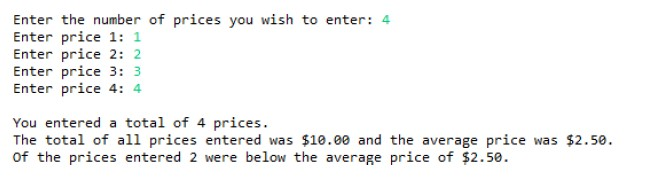

# J1-Ch7-Lab2

## Instructions
- Enter your name, the lab number, and the current date into a comment at the top of the code.
- Correct the problems found in the program. The fully functional program should:
  - Prompt the user to enter the maximum number of prices to enter.
  - Create an array capable of holding the maximum number of prices.
  - Prompt the user to enter each price.
  - Calculate and print the total value of all prices entered.
  - Calculate and print the average price entered.
  - Calculate and print the number of prices entered that are below the average price.
- Place a comment in the code which briefly describes each problem you corrected.

### Example output:

### Grading:
- General, compiles, comments, proper indentation, etc
- First problem found
- Second problem found
- Third problem found
