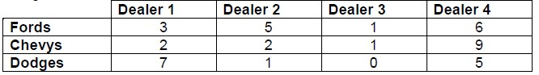
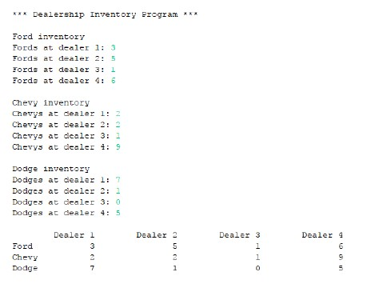

# J1-Ch8-Lab1

## Instructions
- Create a program that does the following:
  - Creates a two-dimensional array that will hold the number of Fords, Chevys and Dodges stocked by four different used car lots. Example data might resemble:  
  
  - Prompts the user to enter in the amount of each make of car for all dealerships
  - Using nested loops, prints the data entered in table format
- Enter your name, the lab number, and the current date into a comment at the top of the code.

### Example Output:

### Grading:
- General, compiles, comments, proper indentation, etc
- Array creation
- Input
- Output
