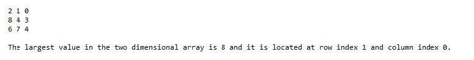

# J1-Ch8-Lab2

## Instructions
- Enter your name, the lab number, and the current date into a comment at the top of the code.
- Correct the problems found in the program. The fully functional program should:
  - Contain a method that takes as an argument a two-dimensional array of any number of integers and prints it out as a matrix.
  - Contain a method that takes as an argument a two-dimensional array of any number of integers, determines what the largest value is in the array then returns a two-element single dimensional array that represents the row and column index of the largest value's position in the array.
  - Contain a main method that tests the program.
- Place a comment in the code which briefly describes each problem you corrected.

### Example output:

### Grading:
- General, compiles, comments, proper indentation, etc
- First problem found
- Second problem found
- Third problem found
