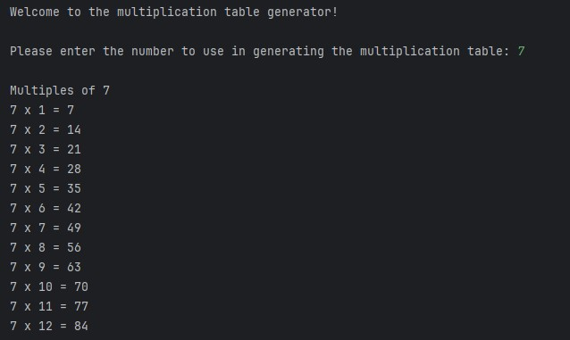

# Exam 1

### Instructions
In this lab you will create a program to generate a multiplication table from 1 to 12, based on the number
a user enters into the program. Here is an example with the user entering 7 as their choice.  

- Clone this repo.
- Edit the exam.py file and construct your program in that file.  
- Add, Commit and Push the repo back to GitHub  

### Requirements
- Greet the user
- Ask the user for a number to use to generate the results
- Store the number as an appropriately typed variable
- Print the heading for the results
- Create a for loop to count from 1 to 12.
  - Inside the loop, use the loop variable and the user number to print each line using an f-string

### Evaluation 
- Greeting the user
- Appropriately typed variable for the user choice
- Printing the heading for the results
- Use of a 'for' loop
- Use of loop variable in the calculation
- Use of loop variable in the output
- Use of user input in the calculation
- Use of user input in the output
- Use of f-string in the output
- Ouput matches the example
