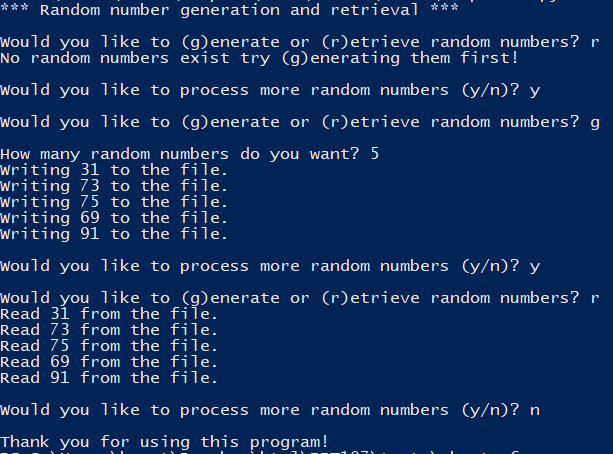
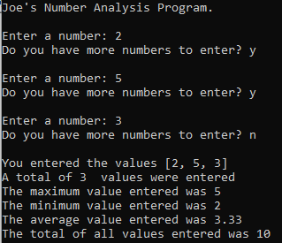
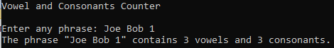

# Troubleshooting Exam

Each python file in this repo will contain between 1 and 4 programming errors. For each error found:  
- Create a line comment in the code that briefly describes the error and what was corrected
- Correct all errors found
- Push the corrected version of the files, including the comments you made, to the assignment repo.
  - DO NOT CREATE NEW VERSIONS OF THE FILES

## f.py

This program allows the user to choose between creating a file filled with random numbers or retrieving a file filled with random numbers. 
- The program should first prompt the user asking if they wish to generate or retrieve random numbers. 
- If they wish to generate random numbers, the computer should ask them how many random numbers to generate and then should generate that many random numbers and store them in a file. 
- If the user indicates they wish to retrieve random numbers, the computer should open a file containing random numbers and print its contents to the screen. 
- If the file does not exist an error message should be displayed, and the program should resume running.
- After the user has seen the results of generating or retrieving the random numbers they should be asked if they wish to run the program again.

## g.py

This program prompts the user to enter a number. The number is then entered in a list. The user is asked if they wish to enter another number. 

When the user indicates they don’t wish to enter another number the program should print all the numbers entered, the number of numbers entered, the maximum number entered, the minimum number entered and the sum of all the numbers entered.  

## h.py

The program should prompts the user to enter a phrase. The program should then calculate and print out the number of vowels and consonants in the phrase entered. The program should be written as follows:
- There should be a function named find_vowels that takes a phrase then calculates and returns the number of vowels found in the phrase.
- There should be a function named find_consonants that takes a phrase then calculates and returns the number of consonants found in the phrase.  

