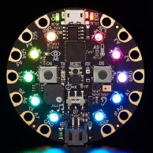

# Setting Up the Circuit Playground Express

### Introduction
The Circuit Playground Express (CPX) is a small form factor device which has at its heart a
microcontroller which can be programmed using a variety of languages. The CPX has a
collection of input sensors and output elements built directly on the unit to make experimenting
with physical computing very accessible. We will be focusing on using Micropython to interact
with the input and output elements and process the information.
The purpose of this lab is to ensure that you have a usable work environment for developing
code to run on your CPX device and to make sure the CPX is ready to work with CircuitPython.

### Hardware
At the heart of the CPX is a Cortex M0 microcontroller. It has
enough computing power and resources to allow for an
interpretive language like Python to run comfortably. In addition to
the powerful microcontroller, the CPX contains a collection of input
and output elements which include 10 Neopixels, 2 pushbuttons, a
speaker, capacitive touch plates and many more ready to use
devices. We are only using a small portion of its capabilities
leaving plenty of opportunities for exploration after you are done
with this course.  

The CPX has a microUSB port which can be used to provide
power and a connection to a computer to upload code. When
connected to a computer the CPX appears as a 2MB flash drive where the Python code needs
to be saved. To have the CPX execute a Python program it must be saved with the file name
‘code.py’. Without the single quotes of course! Other scripts can be saved on the flash drive
with different file names to provide a convenient storage location for your CircuitPython projects.
It’s not a bad idea to save a working project to the flash drive using a descriptive filename and
then just copy and paste the project coded into the ‘code.py’ file and save it. This provides you
with a backup of your project in the original file and your working code is in the ‘code.py’ file.

### Programming Environment
Although any editor can be used to create Python programs stored on the CPX, the [Mu Editor](https://codewith.mu/) is
the recommended IDE because it is simple and can recognize the CPX when connected via
USB. This allows you to view output from print statements in the code as well as possible error
messages from the CPX Python interpreter.

### Lab Procedure

#### Set up your CPX
- The CPX needs to have CircuitPython REPL installed
  - If you have a “BlueFruit” version [GO HERE](https://learn.adafruit.com/adafruit-circuit-playground-bluefruit/circuitpython)
  - If you have the Classic [GO HERE](https://learn.adafruit.com/adafruit-circuit-playground-express/circuitpython-quickstart)
  - There are short videos and good instructions.
- If you have the “BlueFruit” update the libraries
  - Download the [Library Files](https://circuitpython.org/libraries)
  - Unzip the file
  - Copy the folders and files found in the “Library Files” to the “lib” folder on your CPX
- Please contact your instructor if you have issues with these instructions!

#### Install Mu
Install Mu
You will need Mu on some system to be able to work with the CPX.
- [Download](https://codewith.mu/) and Install Mu:
- With your CPX connected launch Mu
- Your CPX should be automatically detected.
  - If you click on the “Mode” button you should see Adafruit CircuitPython selected.
  - If not, select it and click “OK”

### Next Step
Move on to [Part 2](part2.md)
