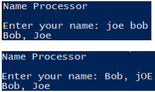

# Name Processing

### Instructions:
 
- Design a Python program that prompts the user to enter their full name then prints it out in the format Last, First. 
  - If the name is already in the Last, First format it should not be modified 
  - If the capitalization is incorrect it should be fixed 
  - Do NOT use the capitalize() function to correct the capitalization use the upper() and lower() functions as discussed in the text book. 
- Enter your name, the lab number, and the current date into a set of comments at the top of the code.	
- Push the program source code to the assignment repo. 

### Example Output

### Grading:
- General, compiles, comments, proper indentation, etc      
- Name Order Processing  
- First Letter Capitalization  
- Remaining Letters Capitalization
